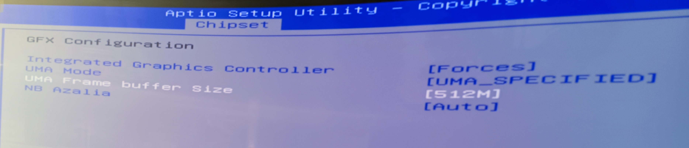

## THANKS to TuxThePenguin0

[bc250-bios](https://gitlab.com/TuxThePenguin0/bc250-bios/) -> Fuente de información y código original

# Pasos para actualizar la BIOS con EFI (pasos detallados en el PDF del [ZIP](https://github.com/scrakcho/BC-250/blob/main/bios/UEFI_MOD_BIOS_BC_250.zip)):
* (1) Prepare una memoria USB en formato FAT32
* (2) Descomprima el archivo ZIP de la BIOS con EFI
* (3) Copie el siguiente archivo en la memoria USB vacía
* (4) Retire todos los discos duros, SSD y unidades USB del BC-250
* (5) Conecte la memoria USB con EFI y reinicie. Aparecerá la siguiente pantalla:
* (6) Ingrese "blk0:"
* (7) Ingrese "Flash.nsh"
* (8) Actualizando... Espere y no realice ninguna operación.
* (9) El reinicio automático indica la finalización de la actualización.

(!) Quizás necesite borrar la CMOS sin batería.

* (10) Una vez con la Bios 3.0 Custom, configurar la memoria como se muestra a continuación para que se automática su gestión y las 16GB se puedan usar para la GPU

 

