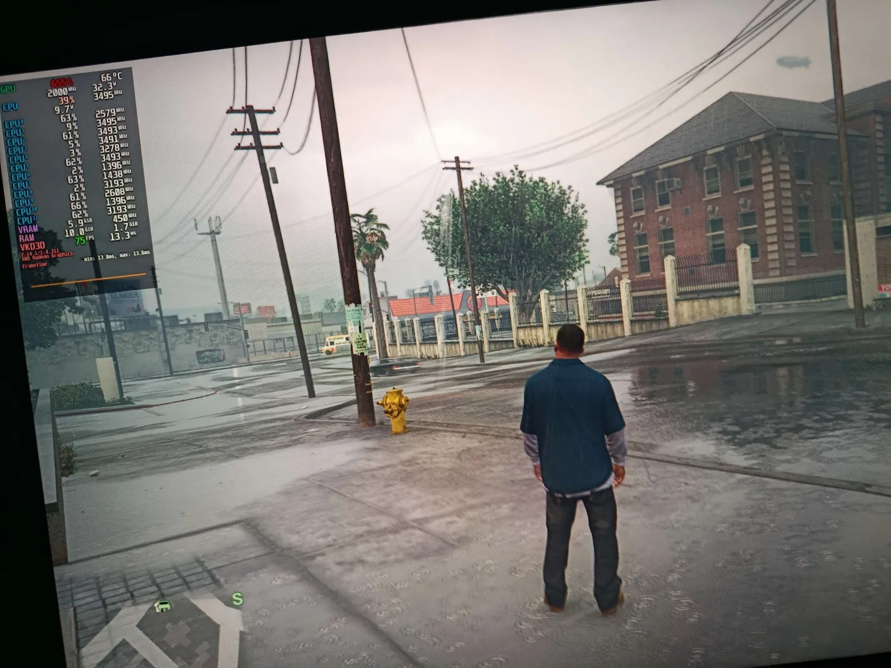
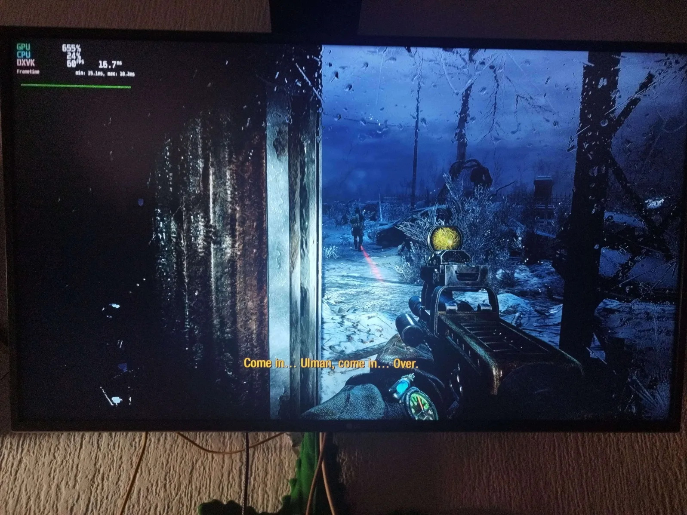

Listado de juegos probados en esta placa BC-250:
* CrashBandicot
  
  

* Cyberpunk
  
  

* RedDeadRedeption2
  
  

* DevilMacry
  
  

* GoW
  
  
  
* MarioKart8Deluxe
  
  

* W40K SpaceMarine
  
  

* GTA5 Enhanted (todo al máximo, sin Raytracing y con los fps trabados a 75)
  
  

* Metro 2033 (vsync y limitado a 60fps estables)
  
  
